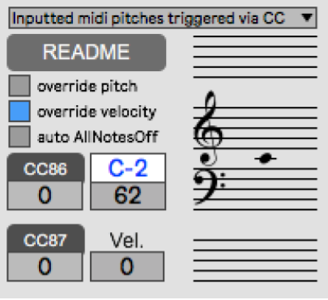

This Patch is part of the [TESSER environment](https://github.com/AdrianArtacho/TesserAkt).

# Tesser_AutoMidi

This device is analogous to an *autotune* effect, only with midi. It takes *midinotes* and allows to substitute the entered midinote *number* and/or *velocity* with alternative **CC values** entered via **CC86** and **CC87**.

---

### Usage

Here is a full description of the functions associated to CC messages within the [TESSER environment](https://bitbucket.org/AdrianArtacho/tesserakt/src/master/).

`override pitch`  

> The entered pitch will be substituted by the last entered **CC86** value.

`override velocity` 

> The entered velocity will be substituted by the ;ast entered **CC87** value.

`auto AllNotesOff` 

> When this toggle is on, a note off (vel = 0) will cause a `0 123` message to be sent to all 16 midi channels.

___

### Use with `clip3seq`

The menu option `trigger CC input with midinote` is designed to trigger the notes entered via CC (usually `CC86` for midi pitch), using the velocity of the midinote entered, for example, with a keyboard.

---

# [📝To-Do](https://trello.com/c/40s0QT7t/253-tesserautomidi)